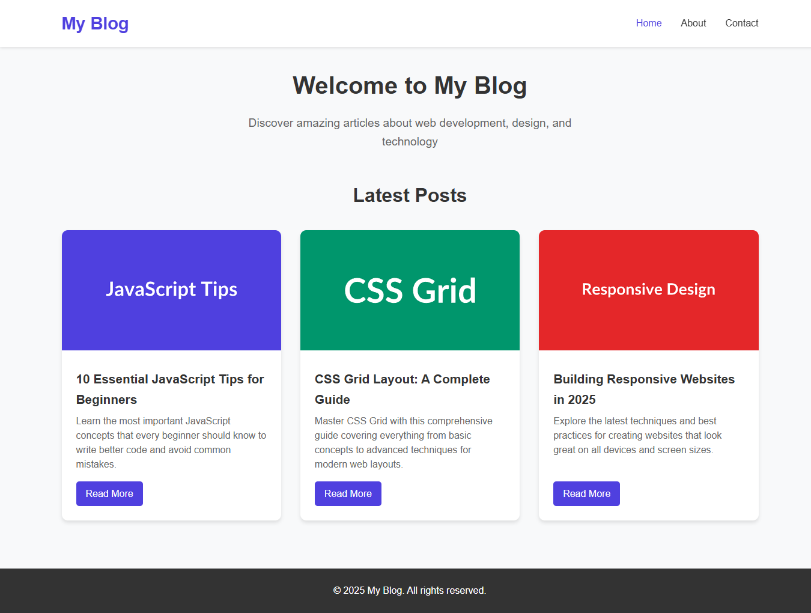

# 📝 Blog App - Static to WordPress Conversion


A comprehensive blog application project demonstrating the conversion from a static HTML/CSS/JavaScript blog to a fully functional WordPress theme. This project showcases both frontend development skills and WordPress theme development expertise.

## 📸 Screenshots

<div align="center">
  
  <p><em>Modern blog interface with responsive design and clean typography - available in both static and WordPress versions</em></p>
</div>

## 🚀 Live Demo

- **Static Blog**: [View Live Static Blog](https://blog-app-shibam.vercel.app)
- **WordPress Blog**: [View Live WordPress Blog](https://wordpress-shibam.lovestoblog.com)

## 📋 Project Overview

This repository contains two complete blog implementations:

1. **Static Blog** (`/static-blog/`) - A responsive static website built with HTML, CSS, and JavaScript
2. **WordPress Blog** (`/wordpress-blog/`) - The exact same design converted into a fully functional WordPress theme

Both implementations maintain pixel-perfect visual parity while demonstrating different approaches to web development.

## 🛠️ Tech Stack

### Static Blog
- **HTML5** - Semantic markup and structure
- **CSS3** - Styling, responsive design with CSS Grid and Flexbox
- **JavaScript (ES6)** - Interactive features and form validation
- **Responsive Design** - Mobile-first approach

### WordPress Blog
- **WordPress** - Content Management System
- **PHP** - Server-side templating and WordPress integration
- **HTML5** - Semantic markup and structure
- **CSS3** - Custom styling, responsive design, and pixel-perfect typography
- **JavaScript** - Interactive features (mobile navigation, scroll to top, form validation)

## 📁 Project Structure

```
blog-app-shibam/
├── 📖 README.md                    # Main project documentation
├── 📸 screenshot/                  # Project screenshots
│   └── blog-app-shibam.png
├── 🌐 static-blog/                 # Static HTML/CSS/JS blog
│   ├── 📄 index.html              # Homepage with blog post grid
│   ├── 📄 post.html               # Single post page template
│   ├── 📄 about.html              # About page
│   ├── 📄 contact.html            # Contact page with form
│   ├── 🎨 css/
│   │   └── style.css           # All styling and responsive design
│   ├── ⚡ js/
│   │   └── main.js             # JavaScript for interactivity
│   ├── 📖 README.md               # Static blog documentation
│   ├── 📜 LICENSE                 # MIT License
│   └── 🚫 .gitignore              # Git ignore file
└── 🔧 wordpress-blog/             # WordPress theme conversion
    ├── 🎨 style.css               # Main stylesheet with WordPress theme header
    ├── ⚙️ functions.php           # Theme functions and WordPress integration
    ├── 📄 header.php              # Header template with navigation
    ├── 📄 footer.php              # Footer template with scripts
    ├── 📄 index.php               # Homepage template with WordPress Loop
    ├── 📄 single.php              # Single post template
    ├── 📄 page.php                # Static page template (About Me & Get In Touch)
    ├── ⚡ js/
    │   └── main.js             # JavaScript for mobile navigation and interactions
    ├── 🗃️ sample-posts.php        # Sample content generator script
    ├── 🗃️ sample-content.sql      # SQL dump of sample content for manual import
    ├── 📖 README.md               # WordPress theme documentation
    ├── 📜 LICENSE                 # MIT License
    └── 🚫 .gitignore              # Git ignore file
```

## 🛠️ Technologies Used

<table>
<tr>
<td align="center"><br><b>HTML5</b></td>
<td align="center"><br><b>CSS3</b></td>
<td align="center"><br><b>JavaScript</b></td>
<td align="center"><br><b>WordPress</b></td>
<td align="center"><br><b>PHP</b></td>
</tr>
</table>

## 🚀 Getting Started

### Option 1: Static Blog (No Server Required)
1. Navigate to the `static-blog/` folder
2. Open `index.html` in your web browser
3. Explore the fully functional static blog

### Option 2: WordPress Theme (Requires WordPress Installation)
1. Navigate to the `wordpress-blog/` folder
2. Follow the installation instructions in the WordPress README.md
3. Install the theme in your WordPress site

## 📱 Features

Both implementations include:

- **Responsive Design**: Works on desktop, tablet, and mobile devices
- **Blog Post Grid**: Homepage displays blog posts in a responsive grid
- **Single Post Pages**: Individual post pages with sidebar
- **Contact Form**: Functional contact form with validation
- **Mobile Navigation**: Hamburger menu for mobile devices
- **Scroll to Top**: Smooth scroll-to-top button
- **Modern UI**: Clean, professional design with hover effects
- **About Page**: Personal introduction with skills showcase

### WordPress-Specific Features
- **WordPress Loop Integration**: Dynamic content from WordPress database
- **Featured Images**: Support for post thumbnails
- **Custom Menus**: WordPress menu integration
- **Sidebar Widgets**: Customizable sidebar with widget support
- **SEO Friendly**: Proper WordPress SEO support

## 📚 Learning Objectives

This project demonstrates:

### Static Blog Development
- Responsive web design with CSS Grid and Flexbox
- JavaScript DOM manipulation and form validation
- CSS best practices and semantic HTML
- Mobile-first development approach

### WordPress Theme Development
- PHP templating and WordPress integration
- WordPress Loop and template hierarchy
- Theme functions and WordPress hooks
- Bootstrap integration in WordPress themes

## 📄 Documentation

Each folder contains its own detailed README.md with specific instructions:

- [`/static-blog/README.md`](static-blog/README.md) - Static blog setup and features
- [`/wordpress-blog/README.md`](wordpress-blog/README.md) - WordPress theme installation and usage

## 📄 License

This project is licensed under the MIT License - see the [LICENSE](static-blog/LICENSE) file for details.

## 🤝 Contributing

Feel free to fork this project and make improvements! This is a learning project, so suggestions and enhancements are welcome.

## 🎯 Next Steps

1. **Explore the Static Blog**: Start with the static version to understand the design and functionality
2. **Install WordPress Theme**: Convert your understanding to the dynamic WordPress implementation
3. **Compare Implementations**: Study how the same features are implemented in both versions
4. **Customize**: Use this as a foundation for your own blog projects

---

*This project serves as a comprehensive example of modern web development practices, from static site creation to dynamic CMS integration.*
