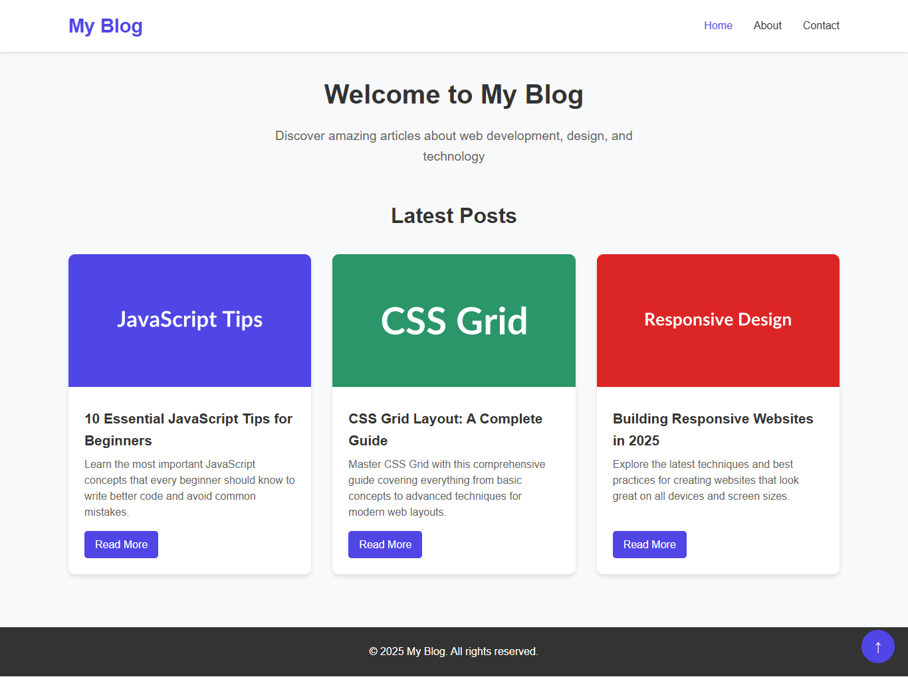

# 🌐 Static Blog Project


A responsive static blog website built with HTML, CSS, and JavaScript. This project demonstrates fundamental web development skills including responsive design, form validation, and interactive features. Features pixel-perfect typography, modern UI design, and serves as the foundation for the WordPress theme conversion.

## 📸 Screenshots

<div align="center">
  
  <p><em>Clean and modern static blog with responsive design and interactive features</em></p>
</div>

> **Part of the Blog App Project**: This static blog is part of a larger project that demonstrates the conversion from static HTML/CSS/JS to WordPress. See the [main project README](../README.md) for the complete overview including the WordPress theme conversion.

## 🚀 Live Demo

[View Live Static Blog](https://static-blog-shibam.netlify.app)

## 📋 Project Summary

This is a complete static blog website featuring a modern, responsive design that works perfectly on all devices. The blog includes a homepage with post listings, individual post pages, an about page, and a contact form with JavaScript validation. This project serves as the design foundation and reference for the companion WordPress theme.

## 🛠️ Tech Stack

- **HTML5** - Semantic markup and structure
- **CSS3** - Styling, responsive design with CSS Grid and Flexbox
- **JavaScript (ES6)** - Interactive features and form validation
- **Responsive Design** - Mobile-first approach

## 🚀 How to Run

1. Download or clone this project
2. Open `index.html` in your web browser
3. Navigate through the different pages using the navigation menu

No build process or server required - it's a static website that runs directly in the browser!

## 📱 Features

- **Responsive Design**: Works on desktop, tablet, and mobile devices
- **Blog Post Grid**: Homepage displays 3 sample blog posts in a responsive grid
- **Single Post Pages**: Individual post pages with sidebar containing categories and tags
- **Contact Form**: Functional contact form with JavaScript validation ("Get In Touch")
- **Mobile Navigation**: Hamburger menu for mobile devices
- **Scroll to Top**: Smooth scroll-to-top button appears when scrolling down
- **Modern UI**: Clean, professional design with hover effects and animations
- **Typography**: Carefully crafted font sizes, weights, and spacing for optimal readability
- **About Me Page**: Personal introduction with skills showcase and professional layout

## 📁 Project Structure

```
static-blog/
├── 📄 index.html          # Homepage with blog post grid
├── 📄 post.html           # Single post page template
├── 📄 about.html          # About page
├── 📄 contact.html        # Contact page with form
├── 🎨 css/
│   └── style.css       # All styling and responsive design
├── ⚡ js/
│   └── main.js         # JavaScript for interactivity
├── 📸 screenshot/         # Project screenshots
│   └── static-blog.png
├── 📖 README.md           # Project documentation
├── 📜 LICENSE             # MIT License
└── 🚫 .gitignore          # Git ignore file
```

## 🛠️ Technologies Used

<table>
<tr>
<td align="center"><br><b>HTML5</b></td>
<td align="center"><br><b>CSS3</b></td>
<td align="center"><br><b>JavaScript</b></td>
</tr>
</table>

### Parent Project Structure
This static blog is part of the larger `blog-app-shibam` project:

```
blog-app-shibam/
├── README.md           # Main project documentation
├── static-blog/        # This static blog (current folder)
└── wordpress-blog/     # WordPress theme conversion
```

## 📚 What I Learned

Building this static blog project helped me understand and practice several key web development concepts:

- **Responsive Web Design**: Using CSS Grid and Flexbox to create layouts that work on all screen sizes
- **JavaScript DOM Manipulation**: Adding interactivity without frameworks, including form validation and mobile menu functionality
- **CSS Best Practices**: Writing clean, organized CSS with proper commenting and efficient selectors
- **Semantic HTML**: Using proper HTML5 elements for better accessibility and SEO
- **Mobile-First Development**: Starting with mobile design and progressively enhancing for larger screens
- **Form Validation**: Implementing client-side validation with clear error messages and user feedback
- **Project Organization**: Structuring files and folders in a logical, maintainable way
- **Code Documentation**: Writing comprehensive, beginner-friendly comments throughout HTML, CSS, and JavaScript files

This project demonstrates that you can create beautiful, functional websites using just the core web technologies without any frameworks or build tools.

## 🔄 WordPress Conversion

This static blog has been converted to a fully functional WordPress theme while maintaining pixel-perfect visual parity. The WordPress version includes:

- Dynamic content management through WordPress CMS
- PHP templating with WordPress Loop integration
- Database-driven blog posts and pages
- WordPress admin panel integration
- Custom menus and widget support

**See the WordPress version**: [`../wordpress-blog/`](../wordpress-blog/) - Complete WordPress theme with installation instructions.

## 🎓 Beginner-Friendly Code

This project has been specifically designed to be **beginner-friendly** with extensive commenting throughout all files:

- **HTML Files**: Every element, attribute, and section is explained in simple language
- **CSS File**: All styles include comments explaining what they do and why they're needed
- **JavaScript File**: Functions and logic are documented with step-by-step explanations
- **Clear Structure**: Code is organized with section headers and consistent commenting style

Perfect for learning web development fundamentals or as a reference for understanding modern web development practices.

## 📄 License

This project is licensed under the MIT License - see the [LICENSE](LICENSE) file for details.

## 📝 Commit History

This project was developed through 5 key commits:

1. **init: add base html files and folder structure** - Initial project setup with basic HTML files and folder organization
2. **feat: add blog listing layout and sample posts** - Homepage blog grid layout with sample blog post content
3. **feat: add single post and contact form with validation** - Individual post pages and contact form with JavaScript validation
4. **style: polish responsive design and add scroll-to-top** - Mobile responsiveness improvements and scroll-to-top functionality
5. **docs: add README** - Documentation and project finalization

## 🤝 Contributing

Feel free to fork this project and make improvements! This is a learning project, so suggestions and enhancements are welcome.

---

## 📞 Contact

- **Email**: Connect-With-Shibam@outlook.com
- **LinkedIn**: [linkedin.com/in/shibam-webdev](https://linkedin.com/in/shibam-webdev)
- **GitHub**: [github.com/Shibam-Code-Pro](https://github.com/Shibam-Code-Pro)

---

⭐ If you found this project helpful, please give it a star on GitHub!
