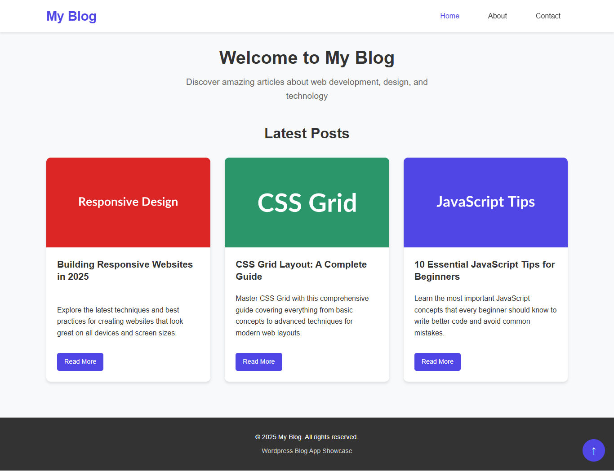

# 🔧 WordPress Blog Theme


A responsive WordPress theme converted from a static blog, featuring pixel-perfect typography, mobile navigation, and clean design. This theme demonstrates fundamental WordPress development skills including PHP templating, WordPress Loop integration, and theme customization with exact visual parity to the original static design.

## 📸 Screenshots

<div align="center">
  
  <p><em>Dynamic WordPress theme with CMS integration and responsive design</em></p>
</div>

> **Part of the Blog App Project**: This WordPress theme is part of a larger project that demonstrates the conversion from static HTML/CSS/JS to WordPress. See the [main project README](../README.md) for the complete overview including the original static blog design.

## 📋 Project Summary

This is a complete WordPress theme featuring a modern, responsive design that works perfectly on all devices. The theme includes a homepage with blog post listings, individual post pages, static pages, and full WordPress integration with Bootstrap 5 for responsive layout.

## 🛠️ Tech Stack

- **WordPress** - Content Management System
- **PHP** - Server-side templating and WordPress integration
- **HTML5** - Semantic markup and structure
- **CSS3** - Custom styling, responsive design, and pixel-perfect typography
- **JavaScript** - Interactive features (mobile navigation, scroll to top, form validation)

## 🚀 Installation Steps

### Step 1: Download the Theme
1. Download or clone this project
2. Locate the `wordpress-blog` folder

### Step 2: Install in WordPress
1. Copy the `wordpress-blog` folder to your WordPress installation
2. Place it in: `wp-content/themes/wordpress-blog/`
3. Log in to your WordPress admin dashboard
4. Go to **Appearance > Themes**
5. Find "My Static Blog WordPress Theme" and click **Activate**

### Step 3: Add Sample Content (EASY WAY)
**🎉 No need to create content manually!** This theme includes sample content that matches the original static blog:

#### For WPLocal (Local by Flywheel) Users:
1. Copy `sample-posts.php` to: `C:\Users\codew\Local Sites\[your-site-name]\app\public\`
2. Visit `http://[your-site-name].local/sample-posts.php` in your browser
3. The script will automatically create all content
4. Delete `sample-posts.php` after running it once

#### For Regular WordPress Hosting:
1. Upload `sample-posts.php` to your WordPress root directory
2. Visit `yoursite.com/sample-posts.php` in your browser
3. The script will automatically create:
   - 3 blog posts (same as static blog)
   - About page with your information
   - Contact page with contact details
4. Delete `sample-posts.php` after running it once

### Step 4: Configure Theme Features
1. **Create Menu**: Go to **Appearance > Menus** and assign menu to "Primary Navigation Menu"
2. **Set Featured Images**: Edit each post and set featured images (URLs provided in sample content)
3. **Customize**: Go to **Appearance > Customize** to set site title and tagline
4. **Upload Logo**: Go to **Appearance > Customize > Site Identity** to upload a custom logo

## 📱 Features

- **Responsive Design**: Works on desktop, tablet, and mobile devices
- **WordPress Loop Integration**: Dynamic blog post listings from WordPress database
- **Pixel-Perfect Typography**: Exact font sizes, weights, and spacing matching the static blog
- **Featured Images**: Support for post thumbnails and featured images
- **Custom Menus**: WordPress menu integration with mobile-friendly navigation
- **About Me Page**: Personal introduction with skills showcase ("About Me" not "About")
- **Contact Form**: "Get In Touch" page with proper form styling and validation
- **Sidebar Widgets**: Customizable sidebar with widget support
- **SEO Friendly**: Proper HTML5 structure and WordPress SEO support
- **Custom Logo**: Bold "My Blog" logo with proper styling
- **Left-Aligned Post Titles**: Homepage post titles properly aligned to match static design

## 📁 Theme Structure

```
wordpress-blog/
├── 🎨 style.css           # Main stylesheet with WordPress theme header
├── ⚙️ functions.php       # Theme functions and WordPress integration
├── 📄 header.php          # Header template with navigation
├── 📄 footer.php          # Footer template with scripts
├── 📄 index.php           # Homepage template with WordPress Loop
├── 📄 single.php          # Single post template
├── 📄 page.php            # Static page template (About Me & Get In Touch)
├── ⚡ js/
│   └── main.js         # JavaScript for mobile navigation and interactions
├── 📸 screenshot/         # Project screenshots
│   └── wordpress-blog.png
├── 🗃️ sample-posts.php    # Sample content generator script
├── 🗃️ sample-content.sql  # SQL dump of sample content for manual import
├── 📖 README.md           # Theme documentation
├── 📜 LICENSE             # MIT License
└── 🚫 .gitignore          # Git ignore file
```

## 🛠️ Technologies Used

<table>
<tr>
<td align="center"><br><b>WordPress</b></td>
<td align="center"><br><b>PHP</b></td>
<td align="center"><br><b>HTML5</b></td>
<td align="center"><br><b>CSS3</b></td>
<td align="center"><br><b>JavaScript</b></td>
</tr>
</table>

### Parent Project Structure
This WordPress theme is part of the larger `blog-app-shibam` project:

```
blog-app-shibam/
├── README.md           # Main project documentation
├── static-blog/        # Original static HTML/CSS/JS blog
└── wordpress-blog/     # This WordPress theme (current folder)
```

## 📚 What I Learned

Building this WordPress theme helped me understand and practice several key web development concepts:

- **WordPress Theme Development**: Creating PHP templates that integrate with WordPress's content management system
- **WordPress Loop**: Using WordPress's built-in functions to dynamically display posts and pages from the database
- **PHP Templating**: Writing beginner-friendly PHP code to create dynamic web pages
- **WordPress Hooks and Filters**: Using `wp_enqueue_scripts`, `after_setup_theme`, and other WordPress hooks
- **Theme Functions**: Creating a `functions.php` file to add theme support for menus, featured images, and custom features
- **Bootstrap Integration**: Properly loading Bootstrap 5 CSS and JavaScript in a WordPress theme
- **Responsive WordPress Design**: Creating mobile-friendly layouts that work with WordPress content
- **WordPress Template Hierarchy**: Understanding how WordPress chooses which template file to use for different content types

This project demonstrates that you can create professional WordPress themes using basic PHP and WordPress functions, without complex frameworks or advanced programming concepts.

## 🔄 Static Blog Foundation

This WordPress theme was converted from a static HTML/CSS/JavaScript blog while maintaining pixel-perfect visual parity. The conversion process included:

- Converting static HTML to dynamic PHP templates
- Integrating WordPress Loop for dynamic content
- Maintaining exact visual design and typography
- Adding WordPress-specific features (menus, widgets, featured images)
- Preserving all interactive JavaScript functionality

**See the original static version**: [`../static-blog/`](../static-blog/) - The foundation static blog with detailed implementation notes.

## 📝 Commit History

This project was developed through 5 key commits:

1. **init: add theme folder and base files** - Initial WordPress theme setup with basic file structure
2. **feat: add header, footer, and enqueue Bootstrap** - Header and footer templates with Bootstrap integration
3. **feat: add index.php with WP loop** - Homepage template with WordPress Loop for dynamic content
4. **feat: add single.php and page.php templates** - Individual post and page templates for complete theme functionality
5. **docs: add README** - Documentation and project finalization

## 📄 License

This project is licensed under the MIT License - see the [LICENSE](LICENSE) file for details.

## 🤝 Contributing

Feel free to fork this project and make improvements! This is a learning project, so suggestions and enhancements are welcome.

## 🔧 Troubleshooting

### Theme Not Appearing
- Make sure the folder is named `wordpress-blog` and placed in `wp-content/themes/`
- Check that all required files (style.css, index.php) are present

### Menu Not Working
- Go to **Appearance > Menus** in WordPress admin
- Create a new menu and assign it to "Primary Navigation Menu"

### No Featured Images
- When editing posts, look for "Featured Image" in the right sidebar
- Upload an image and set it as the featured image

### Sidebar Empty
- Go to **Appearance > Widgets** to add content to the "Blog Sidebar"
- Add widgets like "Recent Posts", "Categories", or "Text" widgets
